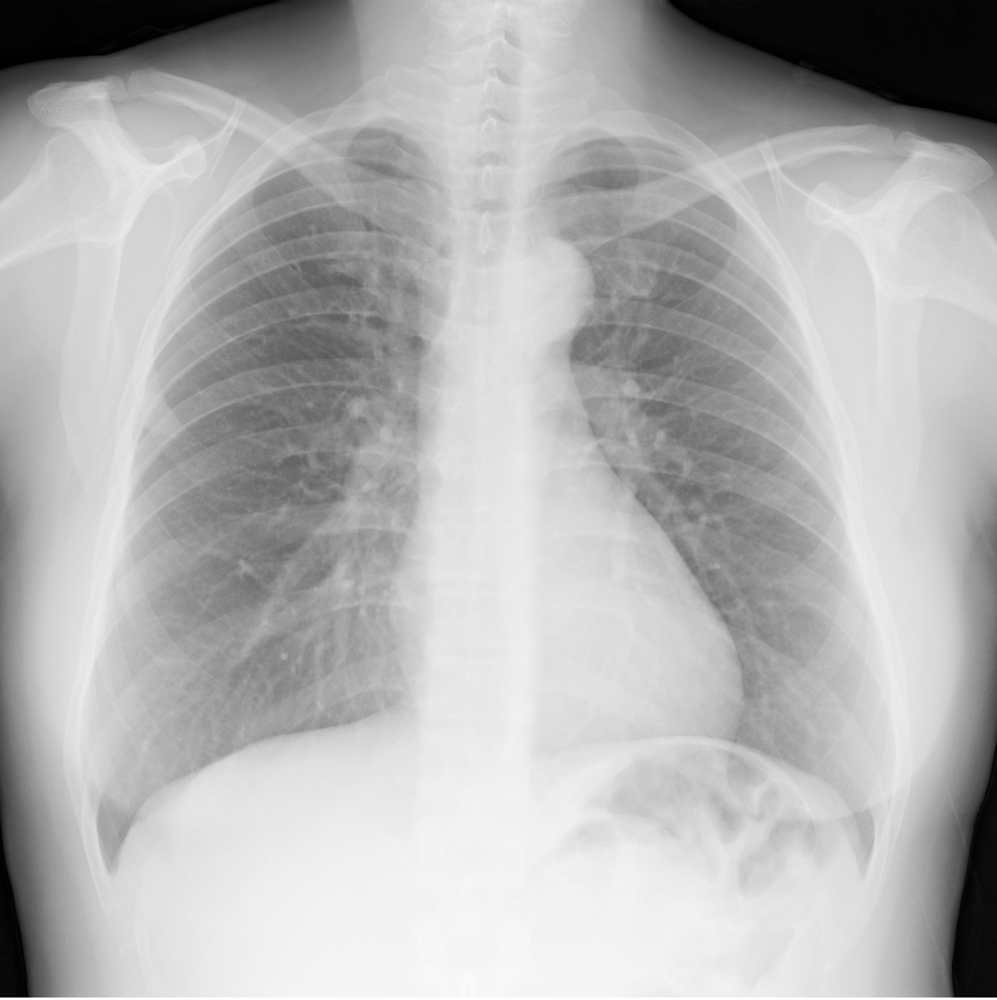
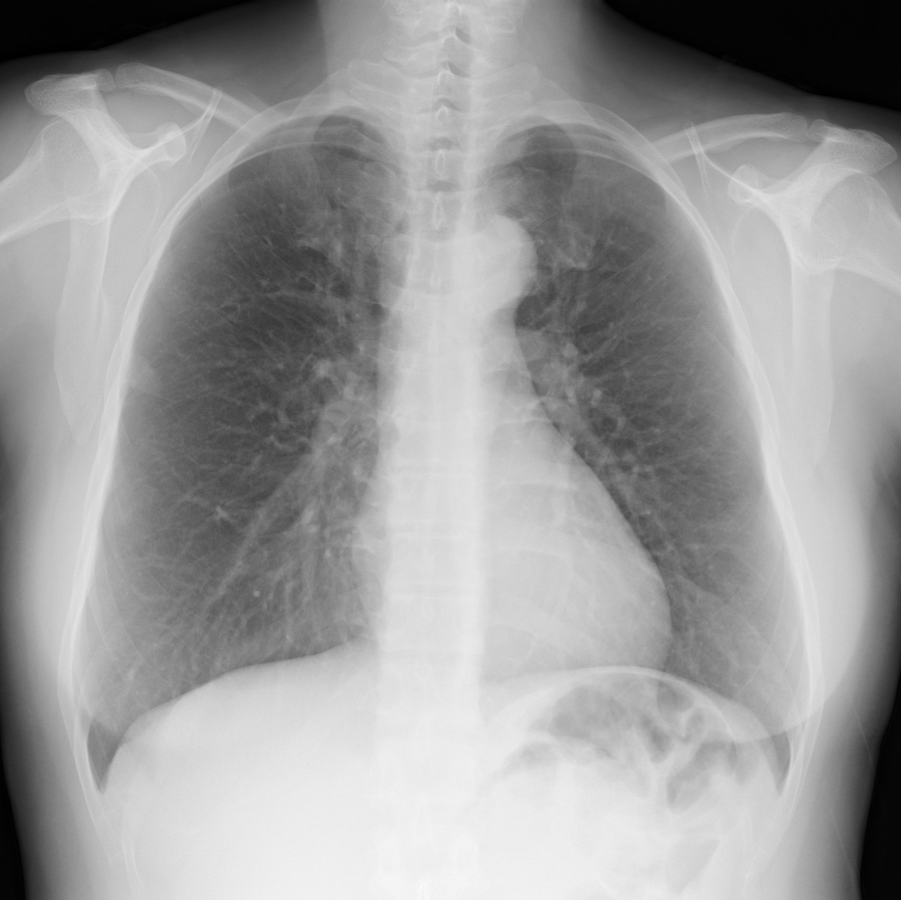

# Impact of Bone Suppression in Tuberculosis Detection  
*A deep-learning pipeline that boosts TB-screening accuracy by learning to “erase” rib shadows from chest X-rays.*

---

## 📜 Project Snapshot
| Component | Purpose |
|-----------|---------|
| **Bone-Suppression Autoencoder** | Learns a pixel-level mapping that eliminates ribs/clavicles while enhancing soft-tissue contrast. |
| **TB Classifier (CNN)** | Binary CNN that predicts Normal (0) vs Tuberculosis (1) from either raw or bone-suppressed images. |
| **End-to-End Evaluation** | Compares diagnostic performance on the same patient images *with* and *without* bone suppression. |

---

## 🎯 Motivation
Chest X-rays are cheap and ubiquitous, but bony anatomy often masks subtle lung lesions. CT or dual-energy subtraction solve this at the cost of **~70× higher radiation** and special hardware. Our goal:  
> *Generate CT-like “bone-free” CXRs in software, then prove that doing so **improves automated TB detection**.* 
---

## 🗂️ Data
| Source | Images | Notes |
|--------|--------|-------|
| **Dataset A** | 4,080 augmented CXRs (light background) | Provides diversity in exposure/contrast |
| **Dataset B** | CXRs with dark background | Complements Dataset A |
| **Combined** | Shuffled union of A + B | Used for all training |

For TB labels we used the **Rahman et al.** public TB-CXR set (split 80 / 10 / 10).  

---

## 🏗️  Method
1. **Autoencoder**  
   *Encoder → Bottleneck → Dual Decoder* trained with **MAE + MSE + reconstruction loss** to suppress bone signal (best validation MAE ≈ 0.02). 
2. **Binary CNN Classifier**  
   - 4 × [Conv → BN → ReLU] blocks  
   - GlobalAveragePooling → Dense(256, ReLU) → Dropout(0.5) → Dense(1, sigmoid)  
   - Loss: *sparse_categorical_crossentropy*; Optimizer: **Adam**. 
3. **Evaluation**: Train two identical CNNs—one on *raw* CXRs, one on *bone-suppressed* outputs—then compare metrics on a held-out test set.

---

## 🖼️ Visual Comparison

   &nbsp;
  

*Figure 1 – Left: original CXR with rib/clavicle shadows.  
Right: autoencoder output revealing lung parenchyma for clearer TB cues.*

## 📈 Key Results
| Model | Test Accuracy | Δ vs Raw |
|-------|--------------|----------|
| Raw CXR CNN | **92 %** | — |
| **Bone-Suppressed CNN** | **95 %** | **+3 pp** |

Bone suppression consistently reduced false-negatives in apical and retro-cardiac lesions. 
